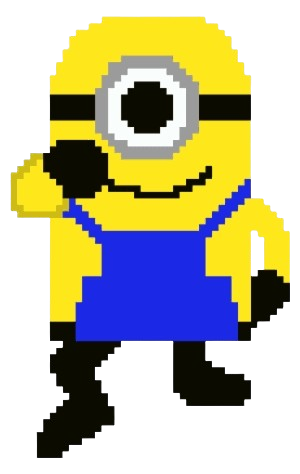
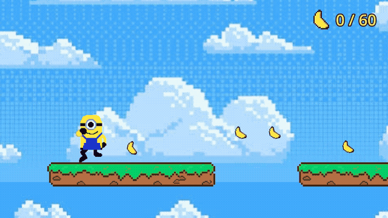
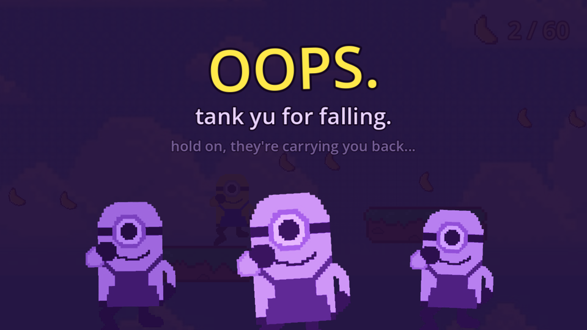

<p align="center">
  
</p>

<h1 align="center">Minionese</h1>

<p align="center">
  a tiny 2D platformer about one minion, a lot of bananas, and zero respect for gravity
</p>

<p align="center">
  <a href="https://aditbajaj.itch.io/minionese"><b>play it in your browser on itch.io</b></a>
</p>

<p align="center">
  
</p>

## what is this

You're a minion. There are bananas floating in the sky for some reason. You want them. That's the whole story, and honestly it's a better plot than half the movies.

Run, jump across floating platforms, grab as many of the 60 bananas as you can, and try not to fall into the endless blue void. You will fall into the endless blue void.

## why I made it

When I was a kid I played some minion game that was super simple and I loved it. No skill trees, no battle pass, just a little yellow guy running around. I wanted to make something in that spirit.

I built it in Godot for Jumpstart at Hack Club Haven. It was my first proper go at a Godot game and I learned a lot, mostly about how many ways a character can clip through a floor.

## controls

| do the thing | keys |
| :--- | :--- |
| move left | `A` or `←` |
| move right | `D` or `→` |
| jump | `Space`, `W` or `↑` |
| fall to your doom | just walk off something |

## the cool stuff

**Squishy movement.** The minion squashes when he jumps and gets flattened a bit when he lands. Small thing, but it makes him feel alive.

**Bananas that actually feel good to grab.** They bob around, sparkle when you touch them, play a little chime (slightly different pitch every time so it never gets annoying) and pop a +1 in the air. There's a counter up top so you know exactly how many you left behind.

**A death screen with attitude.** Fall off and three purple minions rise up from the bottom of the screen to judge you. You also get a random roast, like "the ground was a lie" or "skipped leg day, clearly". Then they carry you back to the start and you try again.

<p align="center">
  
</p>

**Music and sound effects.** Jumping, grabbing bananas and dying all have their own sounds, plus some background music to keep the vibes up.

## screenshots

<p align="center">
  
</p>

## running it yourself

Easiest way is to just [play it on itch.io](https://aditbajaj.itch.io/minionese). No download needed.

or, 

1. Grab [Godot 4.7](https://godotengine.org/download) (the standard one, not the .NET one)
2. Clone this repo

   ```bash
   git clone https://github.com/aditbajaj/minionese.git
   ```

3. Open Godot, hit **Import**, and pick the `project.godot` file
4. Press `F5` and go get those bananas

Godot will ask you for a WakaTime API key on first open because the plugin is enabled. You can just close that popup, or turn the plugin off in Project Settings under Plugins.

## what's where

| file | what it does |
| :--- | :--- |
| `main.tscn` / `main.gd` | the level, the banana counting, and restarting after you die |
| `player.gd` | movement, jumping, squash and stretch, falling into the void |
| `banana.tscn` / `banana.gd` | the bananas, their bobbing and the pickup effects |
| `hud.tscn` / `hud.gd` | the banana counter in the corner |
| `death_screen.tscn` / `death_screen.gd` | the purple minions and the roasts |
| `purple_minion.gdshader` | turns a normal minion purple and evil |
| `minion.gdshader` | cuts the gray background out of the minion sprite so he isn't standing in a box |

## stuff I want to add

More levels. Enemies (probably purple minions, they've earned it). A win screen for when you actually get all 60 bananas. A way to tell people your score so you can flex on them.

## credits

Minions belong to Illumination. This is a fan game made for fun and I'm not making any money from it, please don't sue me, I only have bananas.

<p align="center"><i>bello!</i></p>
